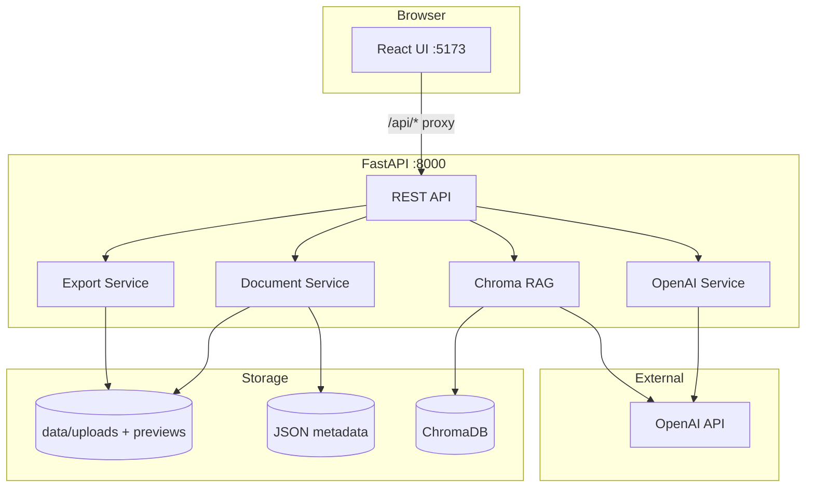

# System Architecture

## High-level diagram



## Request lifecycle

### 1. Upload

```
User drops file → POST /api/documents/upload
→ store original in backend/data/uploads/
→ generate PNG preview(s) in backend/data/preview/{id}/
→ write metadata JSON
→ return document_id + preview_urls
```

**PDF note:** If Poppler is not installed, PDF preview falls back to a text-rendered PNG using `pypdf` extraction. Upload still succeeds; preview is readable but not pixel-perfect.

### 2. Process

```
POST /api/documents/{id}/process
→ load preview images as base64 data URLs
→ OpenAI vision + Pydantic DocumentExtraction schema
→ save extraction to metadata
→ index text chunks in ChromaDB (when API key present)
```

**Without API key:** Uses bundled sample extraction JSON + demo chat fallback so the UI remains demoable.

### 3. Chat

```
POST /api/documents/{id}/chat
→ retrieve top-k chunks from Chroma (live mode)
→ OpenAI structured ChatAnswer { answer, source_snippets[] }
→ frontend highlights snippets in original panel
```

### 4. Export

```
GET /api/documents/{id}/export/docx
GET /api/documents/{id}/export/json
```

## Security model

- `OPENAI_API_KEY` lives **only** in `backend/.env`
- Frontend talks to `/api` via Vite dev proxy (no key in browser)
- No authentication in MVP — acceptable for hackathon demo only

## Local data layout

```
backend/data/
├── uploads/       Original files + {document_id}.json metadata
├── previews/      Normalized PNG previews per document
├── exports/       Generated DOCX/JSON exports
└── chroma/        Persistent ChromaDB collections (one per document)
```

## Key design decisions

| Decision | Rationale |
| --- | --- |
| Server-side AI only | Security + judging requirement |
| Pydantic structured outputs | Reliable schema, no hand-parsed JSON |
| Chroma per document | Simple RAG that scales conceptually |
| File-based storage (no DB) | Fast MVP, no auth/migrations |
| Demo fallback without API key | Stage-safe pitch path |
| Vite proxy to backend | Avoids CORS friction in dev |

## Folder responsibilities

| Path | Role |
| --- | --- |
| `backend/app/api.py` | HTTP routes |
| `backend/app/schemas.py` | Shared Pydantic contracts |
| `backend/app/services/documents.py` | Upload, preview, metadata, demo doc |
| `backend/app/services/ai.py` | OpenAI extraction + chat |
| `backend/app/services/rag.py` | Chunk, index, retrieve |
| `backend/app/services/exports.py` | DOCX + JSON generation |
| `frontend/src/App.tsx` | Entire UI (single-page MVP) |
| `frontend/src/styles.css` | Tailwind + `naskh-*` component classes |
| `run_dev.py` | Dev orchestration, port restart |
